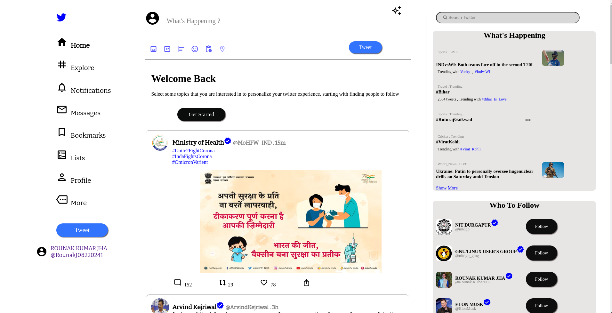
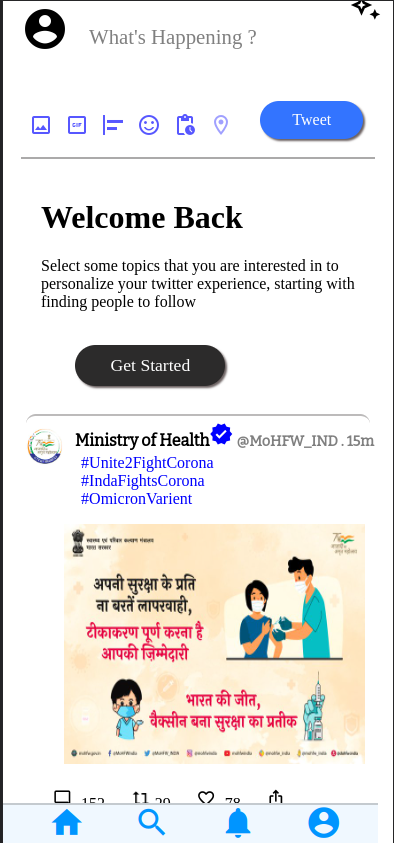

# Twitter Clone Website

# </img> </img>

## FRONTEND

# Desktop_View

# Tab_View

# Mobile_View
 

## Description

A basic Website clone of Twitter-web. This is a Fully responsive site at all screen sizes.  

## Features

- Scroll Action is according to the actual website.
- Website is responsive at all screen sizes.
- You can visit the website for reference purpose. [here](https://twitter-clone-rounak.netlify.app/) 

## Installation and Usage

- Read the [CONTRIBUTING.md](CONTRIBUTING.md) file.

- Clone this repository

- Run the live server